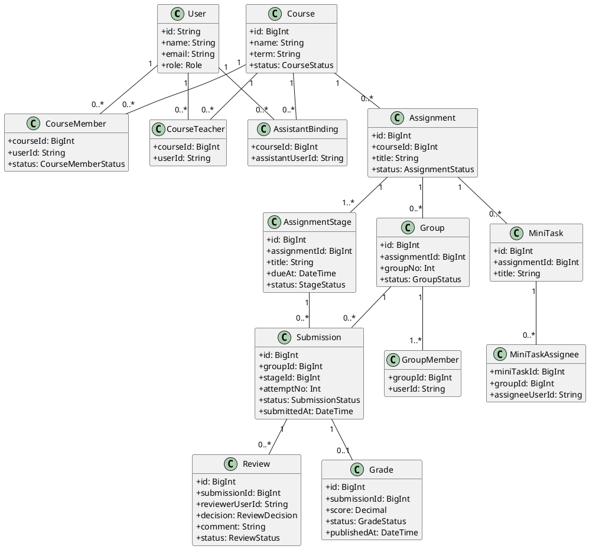
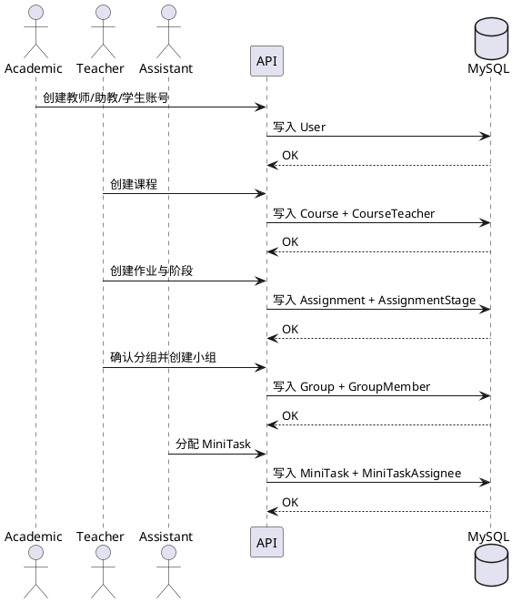
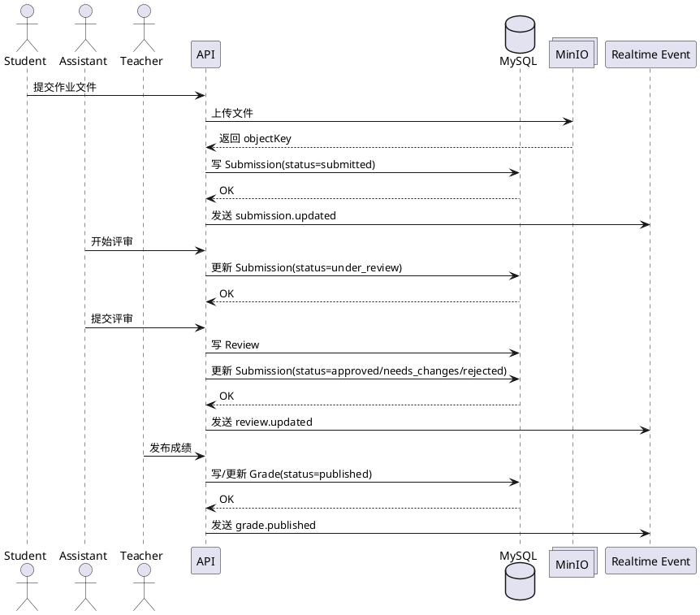

# 软件工程课程汇报：10问回答与PPT生成素材（Linksee）

## 0. 项目背景（开场可用）
- 项目名：`Linksee`
- 类型：课程协作与评审系统（建课、分组、任务分配、提交、评审、发布成绩）
- 架构：`Monorepo`
- 后端核心：`apps/api`
- 技术栈：`Node.js + TypeScript + Express + Prisma + MySQL + Redis + MinIO + JWT`
- 测试：`Jest + Supertest`（单元 + 集成）

---

## Q1 + Q2（合并）：是否使用 IDE，是否使用高级 IDE？
**回答建议：**

我们使用了 IDE，并且使用了高级 IDE 能力。团队统一使用 `VS Code`。

不仅是编辑代码，还使用了：
- TypeScript 类型检查与智能补全
- 重构能力（重命名、提取函数）
- 断点调试接口链路
- Git 图形化对比与冲突处理
- 在 IDE 内直接运行和定位 Jest 失败用例

**结论：**  
不是“只用了编辑器”，而是把 IDE 当作工程开发平台使用。

---

## Q3：是否使用了现有包或组件？
**回答建议：**

是，项目大量使用成熟组件，避免重复造轮子：
- `Express`：HTTP 路由与中间件管线
- `Prisma`：ORM、模型定义、数据库访问（MySQL）
- `ioredis`：Redis 客户端（缓存与实时能力辅助）
- `MinIO`：对象存储（课程资料/提交附件）
- `jsonwebtoken`：鉴权与登录态
- `argon2`：密码哈希存储与校验
- `Multer`：多文件上传解析
- `socket.io`：实时事件推送
- `dotenv`：环境变量加载
- `Jest + Supertest`：测试与接口验证

**一句话总结：**  
通用能力用成熟组件，业务复杂度留给课程场景本身。

### 组件分类与作用（答辩建议按此讲）
#### 1) 安全与身份认证
- `argon2`：密码不明文存储，提升口令安全性
- `jsonwebtoken`：令牌签发与校验，支持接口鉴权和会话管理

#### 2) Web 接口与通信
- `express`：统一路由、中间件、错误处理
- `socket.io`：提交状态/评审状态/成绩发布的实时通知

#### 3) 数据访问与持久化
- `@prisma/client + prisma`：模型定义、查询、事务、类型安全
- `mysql`（基础设施）：业务主数据存储
- `ioredis + redis`（基础设施）：缓存与实时辅助能力

#### 4) 文件与对象存储
- `multer`：解析 multipart/form-data 文件上传
- `minio`：存储提交附件和课程资料，返回 objectKey/url

#### 5) 配置与工程化
- `dotenv`：按环境加载配置，减少硬编码
- `typescript`：静态类型约束，降低联调错误率
- `tsx`：本地运行 TS 脚本与任务

#### 6) 测试质量保障
- `jest`：单元与集成测试框架
- `supertest`：HTTP 接口行为验证

---

## Q4：使用这些组件相对“不使用组件”的具体好处
### 1) 开发效率
- 使用 Prisma：实体关系与 CRUD 快速落地
- 不用 ORM：需要手写大量 SQL、映射与错误处理

### 2) 稳定性
- Express/JWT/Multer/Prisma/Socket.IO 已被广泛验证
- 自研底层细节会放大边界条件 bug 风险

### 3) 团队协作
- 统一框架后代码风格与边界更一致
- 组件文档完善，团队 onboarding 更快

### 4) 扩展性
- 新增评审规则、通知机制、文件类型时可增量扩展
- 若无组件，每次迭代常需改动大面积底层代码

### 5) 可测试性
- Jest/Supertest 能直接做接口行为验证
- 无标准工具链时回归成本高、漏测风险大

### 6) 安全与合规基础更稳
- `argon2 + JWT` 形成密码与会话的基础安全闭环
- 若完全自研认证链路，容易在过期、签名、口令存储上出错

---

## Q5：项目类图（UML）代码（PlantUML）
> 说明：以下为可直接生成的规范类图代码，偏“领域模型 + 关系”表达。



---

## Q6：对象图是什么意思？（答辩解释）
对象图是“某一时刻系统实例状态的快照”。

- 类图描述“类型和关系”
- 对象图描述“当前实际存在的对象及其连接关系”

例如：
- `courseSE2026:Course`
- `teacherZhang:User`
- `group3:Group`
- `stage1:AssignmentStage`
- `submission102:Submission(status=submitted)`
- `review51:Review(status=under_review)`

**一句话：**  
对象图回答“现在系统正在发生什么”。

---

## Q7：顺序图（按全流程）
### 7.1 创建课程 -> 创建项目 -> 创建小组 -> 分配 MiniTask


### 7.2 学生提交 -> 评审 -> 发布


---

## Q8：项目是否使用设计模式（经典模式视角）
### 建议先说明（答辩非常关键）
本项目**不是从第一天就严格按某个单一模式设计**。  
项目初期以“先打通业务闭环”为目标（建课、分组、提交、评审、发布），当时没有系统化地按设计模式建模。  
随着模块增多，我们进行了分层和边界整理，代码逐步收敛为多种经典模式的组合。

因此，项目是“**多模式协同**”，不是“唯一模式对应”。

### 进一步思考：复杂系统中的“复合模式”
在真实工程中，单一模式几乎不会孤立出现。  
更常见的是“复合模式（Compound Patterns）”：多个模式围绕同一业务链路协同工作。

以本系统“提交 -> 评审 -> 发布”为例：
- `Facade`：对外提供统一业务入口，屏蔽内部子系统复杂度
- `Strategy`：按角色/状态切换不同处理策略
- `Adapter`：统一接入 MinIO/Redis/Prisma 等外部依赖
- `Bridge`：把业务抽象与通知/存储实现分离，支持独立替换
- `Composite`：在课程层级结构上做统一处理（课程/作业/阶段/小组）

这不是“模式堆砌”，而是围绕**变化点、复杂点、层级点**进行针对性设计。

### 设计模式与实现映射（按课件术语，不以“路由文件”作为核心论据）
#### 1) Adapter（适配器）
- 目标：隔离第三方依赖差异，避免业务层直接耦合 SDK 细节
- 在项目中的实现：
  - 存储适配：`apps/api/src/infra/minio.ts` + `submission-file-storage.ts` + `course-material-storage.ts`
  - 缓存/实时适配：`apps/api/src/infra/redis.ts` + `events/realtime-*`
  - 数据访问适配：`apps/api/src/infra/prisma.ts`
- 效果：未来替换实现（如 MinIO -> S3）时，业务代码改动范围可控

#### 2) Bridge（桥接）
- 目标：把“业务抽象”与“实现通道”分离
- 在项目中的实现：
  - 业务侧：提交/评审/成绩发布流程（submissions/grading 模块）
  - 实现侧：DB 持久化 + Realtime 推送（MySQL + Redis/Socket）
- 效果：业务规则不依赖具体通知通道，后续可扩展邮件/站内消息等

#### 3) Facade（外观）
- 目标：为复杂子系统提供统一入口，降低调用方复杂度
- 在项目中的实现：
  - 业务入口统一编排提交/评审/发布，底层再调用存储、数据库、事件子系统
  - 对外屏蔽内部细节（权限、状态流转、文件、事件发送）
- 效果：前端和调用方只依赖稳定接口，不关心后端内部编排细节

#### 4) Composite（组合）
- 目标：统一处理树状/层次结构
- 在项目中的实现：
  - 课程层级：Course -> Assignment -> Stage -> Group -> GroupMember
  - 任务层级：Assignment -> MiniTask -> Assignee
- 效果：在权限判断、统计、状态汇总时可按层级一致处理

#### 5) Strategy（策略）
- 目标：把可变规则（尤其权限规则）从主流程中抽离
- 在项目中的实现：
  - 按角色切换策略：teacher / assistant / student 的访问与操作边界
  - 典型位置：`group-access.ts`、`course-access.ts`、grading/submission 权限判断
- 效果：新增角色或调整权限时，不需要重写整条业务主流程

### 代码示例（可放到 PPT 作为“模式落地证据”）
#### A) Strategy（角色策略分支）
> 来源：`apps/api/src/groups/group-access.ts`
```ts
if (role === Role.teacher) {
  const teacher = await prisma.courseTeacher.findUnique({
    where: { courseId_userId: { courseId: assignment.courseId, userId } },
    select: { courseId: true },
  });
  if (!teacher) {
    forbidden(res, "Only course teachers can manage groups");
    return null;
  }
  return assignment;
}
```

#### B) Adapter（存储适配）
> 来源：`apps/api/src/submissions/submission-file-storage.ts`
```ts
await minioClient.putObject(
  env.minioBucketSubmissionFiles,
  objectKey,
  input.file.buffer,
  input.file.size,
  { "Content-Type": input.file.mimetype },
);
```
说明：业务侧只关心“上传提交文件”，不关心 MinIO SDK 细节，后续可替换底层实现。

#### C) Bridge（业务与实现解耦）示意
```ts
// 业务抽象：状态更新
await prisma.submission.update({ ... });
// 实现通道：实时通知
await pushSocketEvent(`group:${groupId}`, statusEvent);
```
说明：业务规则与通知通道分离，通知实现可替换。

#### D) Facade（统一入口）示意
```ts
// SubmissionFacade.submit(...)
// 1) 校验权限与阶段状态
// 2) 上传文件
// 3) 写入 Submission
// 4) 推送事件
```
说明：调用方只调用一个高层入口，不直接触达多个子系统。

#### 外观模式图与当前代码（As-Is）的区别（PPT讲解重点）
**为什么图里有 `SubmissionFacade`，代码里却不一定有同名类？**  
因为外观模式图表达的是“架构意图（To-Be）”，而当前代码更多是“实现现状（As-Is）”。

1) 外观图（To-Be）强调的内容  
- `Client` 只调用一个高层入口（如 `submit()`）  
- 入口内部编排多个子系统：权限、校验、存储、持久化、事件  
- 目标是“对外简单、对内可重构”

2) 当前代码（As-Is）的真实形态  
- 主要在 `submissions-router.ts` 中完成流程编排  
- 通过 helper 函数与基础设施模块协作（而非显式 `SubmissionFacade` 类）  
- 仍然具备“统一入口编排多个子系统”的特征

3) 二者关系（答辩建议表述）  
- 不是“图和代码矛盾”，而是“同一思想在不同抽象层表达”  
- 图是模式化抽象（便于解释设计），代码是工程化落地（便于快速交付）  
- 后续若系统复杂度继续上升，可将现有编排逻辑显式提炼为 `SubmissionFacade/UseCase` 类

**可直接口播：**  
“我们的外观模式图是架构意图图；当前代码尚未完全类化为 Facade，但在流程上已经体现了 Facade 的核心，即统一入口封装多子系统协作。”

#### E) Composite（层级结构统一处理）示意
```text
Course
 └─ Assignment
    └─ Stage
       └─ Group
          └─ GroupMember
```
说明：对层级节点进行统一权限/统计处理，扩展新层级时结构稳定。

### 为什么不追求“单一模式统一全系统”
1. 复杂系统存在多个变化维度（角色、流程、存储、通知、层级），单一模式无法覆盖全部问题。  
2. 模式之间是互补关系，不是替代关系：  
   - `Strategy` 负责“怎么变”  
   - `Facade` 负责“怎么简化调用”  
   - `Adapter` 负责“怎么接第三方”  
   - `Bridge` 负责“怎么解耦抽象与实现”  
   - `Composite` 负责“怎么统一层级对象处理”  
3. 工程目标不是“模式纯度”，而是“可演进性、可维护性、可测试性”。

---

## Q9：未来如何处理组件变更或功能扩展（与设计模式联动）
### 先说明 Q8 与 Q9 的关系
Q8 回答“当前已经形成了哪些模式”；  
Q9 回答“未来如何继续利用这些模式降低变更成本”。

也就是说：  
我们不是一开始就完美模式化，而是在迭代中逐步收敛，并将这种收敛继续用于未来扩展。

### 具体扩展策略
- 存储替换（如 MinIO -> S3）：走 `Adapter`，业务层不改
- 角色扩展：走 `Strategy`，新增策略实现
- 通知扩展（WebSocket/邮件/站内消息）：走 `Bridge`
- 对外接口稳定：通过 `Facade` 保持调用方不受内部重构影响
- 层级扩展（课程/作业/阶段/小组）：复用 `Composite` 的层级处理思路

### Q9 答辩建议（一句话）
我们不追求“全系统单一模式”，而是针对高变化点选择模式；  
未来扩展时继续沿着 Adapter/Bridge/Strategy/Facade/Composite 这条边界演进。

### 面向未来的模式化演进建议（可作为“加分项”）
1. 引入显式的 `Strategy` 接口层（权限策略、评审策略、评分策略），减少条件分支扩散。  
2. 提炼 `Facade` 服务对象（如 SubmissionFacade/ReviewFacade），让“用例编排”从控制层进一步沉淀。  
3. 为 `Adapter` 层定义统一契约（StoragePort/CachePort），降低第三方替换成本。  
4. 在 `Bridge` 方向上拆分“事件生产”与“事件传输”，便于后续接入消息队列。  
5. 在 `Composite` 层补充统一遍历/聚合工具，减少层级处理逻辑重复。

**目标：**  
把变化控制在可替换层，而不是核心业务层。

---

## Q10：随着迭代，如何处理遗留代码（技术债）
建议“4步闭环”：

1. 识别：建立技术债清单（按风险/影响分级）
2. 保护：先补最小测试，锁定旧行为
3. 迁移：用 Adapter/Facade 包裹旧实现，逐步迁移调用点
4. 清理：设定淘汰窗口，删除无引用遗留代码

配套机制：
- 每个迭代预留 10%~20% 容量偿债
- PR 增加“技术债影响”检查项
- 覆盖率、Lint、CI 作为质量守门

### 遗留需求如何处理（Legacy Requirements）
核心原则：**先确认“真实被使用的需求”，再决定保留/重构/下线**。

1. 需求盘点  
   - 来源不只看文档，还看真实接口调用、前端依赖、线上数据与操作日志。
2. 需求分级  
   - 必须保留（核心链路）/ 可调整（流程优化）/ 可下线（无人使用或过时）。
3. 基线固化  
   - 用关键回归用例把旧行为固定，避免“改造后功能漂移”。
4. 增量演进  
   - 每次只处理一条业务链路，做完就验证并发布。

**项目例子（Linksee）**  
- 通过业务与接口对齐，确认提交状态集合为：  
  `not_submitted / submitted / under_review / approved / needs_changes / rejected`  
- 进一步明确：`under_review` 仅用于评审进行中；到截止未交统一进入 `not_submitted`。

### 遗留代码如何处理（Legacy Code）
核心原则：**不大爆炸重写，采用“隔离 -> 替换 -> 下线”的治理路径**。

1. 建立隔离边界  
   - 新代码不得直接扩散耦合到旧实现，先通过统一入口/适配层收口。
2. 先测后改  
   - 改造前补最小测试（单测/集成），锁定旧行为，再进行重构。
3. 分片替换  
   - 按高风险模块优先（权限、状态机、数据一致性）逐步替换。
4. 删除冗余  
   - 替换稳定后清理重复代码、无效分支、过时代码路径。
5. 门禁防回潮  
   - 通过 Code Review + CI，防止新遗留再进入核心链路。

**项目例子（Linksee）**  
- 文件链路治理：业务层统一走提交文件存储函数，不直接散落调用底层 SDK。  
- 状态机治理：提交/评审/发布流程通过测试固化后再收敛分支，逐步清理历史状态痕迹。  
- 权限治理：将权限判断集中到 access helper，避免在多个接口重复拷贝判断逻辑。
